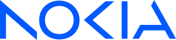
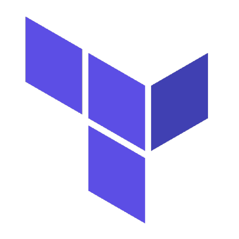

<h1>Hi there, I'm Ozan  </h1>

<h3 align="center">Infrastructure Platform Engineer, Nokia</h3>

- 🔭 exploring new techs, developing better approaches on existing ones and improve the way how I play
- 💬 ask me about Linux, SysOps and DevOps
- 📖 working & keeping up to be a lifetime learner and best effort person
- ☕ coffee/tea addict (filter coffee/turkish tea pls), 
- 🏀 hooper (T-Mac, Vesely, Bogdanovic my legends)
- ⚡ motto: believe the fate, follow the way, feel relieved, do your best cuz you're alive & have every posibility to live
- 📝 quote: Success is impeccable effort. Not the performance or the result. - David Blatt

## 🧰 Skills

## 🔗 Links

<!-- 
Prometheus, Terraform
-->
<!-- 

-->

<!--
**oziie/oziie** is a ✨ _special_ ✨ repository because its `README.md` (this file) appears on your GitHub profile.

Here are some ideas to get you started:

- 🔭 I’m currently working on ...
- 🌱 I’m currently learning ...
- 👯 I’m looking to collaborate on ...
- 🤔 I’m looking for help with ...
- 💬 Ask me about ...
- 📫 How to reach me: ...
- 😄 Pronouns: ...
- ⚡ Fun fact: ...

*** SKILLS NEW ICON:
🧰
*** PROFILE VIEW:

-->
